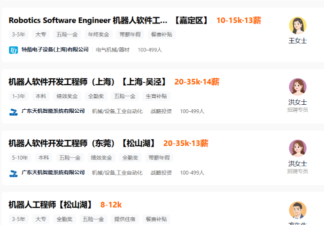

# 机器人学习

## 前言

### 说明

机器人是一大类，所需的知识都与本专业有关，不要有“我是学飞行器的，又不是学机器人的”的成见。

毕竟还有飞行机器人嘛。文章中所涉及的专业知识不一定要会。

### 通过学习，你将获得什么

+ 学会工科(尤其是飞行器制造专业)所需的大部分内容
+ 获得各种证书（计算机二级的office应用、计算机二级的c语言、计算机二级的python语言、计算机二级Linux、软件工程师）【都是顺带考证】【不要以为这些证书只有计算机专业的学生拿，这些都是社会性考试，人人都可以参加。而且题目都不是很难，可以说是基础，学个两三个月就可以考了（我看过）】
+ 获得参加竞赛的机会（可参加的竞赛有数学建模(学习中包涵)、蓝桥杯、Robocon、RoboMasters等机器人大赛、程图比赛、“互联网+”创新创业大赛）【这些对你保研、考研、找工作都有很大的用处的】
+ 获得就业机会(可能现在对就业没有什么意识，当你离开学校找工作时，就知道了)【通过学习，你会参加一些竞赛，若取得较好的成绩，会被一些大厂录用。比如，你参加了Robocon、RoboMasters的机器人大赛获得全国大赛前三名，会被大疆无人机公司录用(真的👍)，要敢于去做，万一成功了嘞】
+ 无需为毕业设计着急，学习过程中，会创造许多的小玩意、小创造（比如：制作一个四旋翼飞行器）【毕业设计需要设计一台机器的，应该学习】

### 集体学习的优势

1. 减少个人学习的懈怠，提高个人进取性
2. 明确学习路线、让学习不迷茫
3. 创造良好的学习环境，提高学习动力
4. 相互学习，相互借鉴，解决彼此的学习方面的问题
5. 团队协作，集中力量办大事

### 机器人工程师薪资了解(没必要过于注重)

##  机器人简介

**机器人学的核心问题是做好和物理世界的交互**。现在主流的机器人学分支里，处理与物理世界的交互的学科分为三类：**传感器和处理算法（激光雷达，多目视觉，融合算法）；多刚体系统动力学控制（工业机器人动力学控制和接触力控制）；机器人自主移动**（locomotion不知道该怎么翻译，轮式、足式、飞行等移动机器人的研究）。

## 学习的核心

四大核心技术

+ 感知。视觉传感器、图像传感器、触觉和力传感器、惯导等。
+ 认知。人工智能、知识表达、规划、任务调度、机器学习等。
+ 行为。运动学、动力学、控制、manipulation和locomotion等
+ 数学基础。最优估计、微分几何、计算几何、运筹学等。

## 学习的基础

### 数学基础

+ 线性代数：线性代数是机器人学、计算机图形学和机器学习等领域的基础。了解矩阵操作、向量空间、线性变换、特征值与特征向量等概念，对理解机器人运动学和运动规划至关重要。
+ 微积分：微积分是研究机器人运动、动力学和控制的基础。了解微分和积分的概念、导数和微分方程，对于建立机器人的运动模型和控制器非常重要。
+ 概率论与统计学：概率论和统计学是机器学习和感知任务中的核心概念。了解概率分布、条件概率、贝叶斯定理、统计推断等知识，有助于处理传感器噪声、进行机器学习模型训练和推断。
+ 优化理论：优化理论在机器人运动规划、轨迹生成和控制中起着重要作用。了解常用的优化算法，如梯度下降、牛顿法和遗传算法等，能够帮助优化机器人的行为和性能。
+ 统计机器学习：理解机器学习的基本概念和算法，包括监督学习、无监督学习和强化学习等。了解回归、分类、聚类和深度学习等方法，有助于机器人感知和决策任务。
+ 统计机器学习：理解机器学习的基本概念和算法，包括监督学习、无监督学习和强化学习等。了解回归、分类、聚类和深度学习等方法，有助于机器人感知和决策任务。
+ 数值计算：熟悉数值计算方法，如数值积分、数值优化和数值求解微分方程等。这些方法在机器人运动和控制的数值模拟和仿真中非常有用。

### 计算机科学基础

+ 了解计算机科学的基本原理，包括算法、数据结构、编程语言和软件开发等(主学C语言和python语言，辅助学习HTML和JavaScript)。
+ 机器学习和模式识别：学习机器人感知需要了解机器学习和模式识别的基本原理和算法。掌握监督学习、无监督学习和深度学习等技术，以便应用于感知任务中。
+ 计算机视觉：学习机器人的视觉感知需要了解计算机视觉的基本概念和技术，如图像处理、特征提取、目标检测和图像分割等。
+ 自然语言处理：学习自然语言处理的基本技术，包括文本处理、语义分析、语言生成等。熟悉自然语言与机器人之间的交互和理解。
+ 规划与任务调度：熟悉规划和任务调度的基本概念和技术。了解规划算法、搜索算法、优化算法等，以及如何将任务分解和调度到机器人的行为序列中。
+ 人工智能基础：了解人工智能的基本原理和技术，包括机器学习、推理、知识表示与推理、自然语言处理等。熟悉不同类型的人工智能算法和方法。
+ 编程和算法：具备编程技能，能够实现机器人行为控制的算法。熟悉常用的编程语言和机器人控制框架，如ROS（机器人操作系统）。

### 物理学

+ 刚体动力学：了解刚体的基本概念和动力学原理。学习力矩、角速度、角加速度等刚体运动的物理量，以及牛顿运动定律和欧拉运动方程。
+ 运动学：研究机器人的位置、速度和加速度等运动特性。了解直线运动、旋转运动和复合运动的描述方法和数学表达。
+ 力学和静力学：掌握力的概念、力的作用点和力矩的计算。了解静力学平衡和物体的受力分析，对于机器人的稳定性和力学设计至关重要。
+ 传感器和测量：了解常用的力传感器、加速度计、陀螺仪等物理传感器的工作原理和测量方法。学习测量误差和噪声，以及如何对传感器数据进行校准和滤波。
+ 飞行器原理

### 机械原理与控制

+ 机械学和材料力学：了解刚体的结构和机械连接件，以及材料力学的基本原理。研究机械结构的刚度、强度和变形特性，对机器人的设计和性能评估具有重要意义。
+ 机器人操作学（Manipulation）：学习机器人的操作学，即如何进行精细操作和物体操纵。了解机器人手臂的逆运动学、抓取策略和力控制等技术。
+ 机器人学基础：熟悉机器人学的基本概念和原理，包括机器人的运动学、动力学和轨迹规划等。这些知识可以帮助你更好地理解机器人感知和感知反馈控制。
+ 控制理论与反馈控制：了解控制理论的基本概念和技术，如反馈控制和控制器设计。理解控制系统的稳定性、鲁棒性和性能分析，对于实现机器人的精确控制和运动规划至关重要。
+ 机器人运动学（Locomotion）：研究机器人的运动学和运动控制方法。了解机器人的行走、奔跑、飞行等运动方式，并学习如何实现稳定和灵活的机器人运动。

### 电子电路

+ 电子学和电路理论：机器人中的电子设备和电路是实现控制和感知功能的基础。了解电流、电压、电阻等基本概念，以及模拟电路和数字电路的设计与分析。
+ 信号处理：了解信号处理的基本概念和技术，包括数字信号处理、滤波器设计和频谱分析等，这些技术在传感器数据处理中起着重要作用。
+ 传感器技术：了解各种传感器技术，包括视觉传感器（如相机和激光雷达）、触觉和力传感器、惯性导航传感器等。理解它们的原理、工作方式和数据处理方法。

### 英语基础

+ 具有基本的英语阅读能力（毕竟需要翻看外国文档，例如：编程需经常学习语法文档）

## 四年规划

### 大一

+ 注册一个VPN,学会翻墙，(没有开玩笑，毕竟得承认国外的某些技术比中国强😊)
+ 注册一个Google账号，学会使用Google，毕竟百度、360浏览器并不是所有东西都能搜索得到的
+ 注册一些账号：GitHub、Gittee、Gmail、 stackoverflow 等,世界上的最先进的技术（编程和机器学习层面），没事就去逛逛。
+ 重视英语学习，当你开始努力学习一些高级的机器人知识以后，有可能会非常难以找到中文的参考资料，这个时候如果啃不下英文的资料，进步速度和眼界就会受到很大影响
+ 重视数学学习，尤其是微积分、线性代数、概率论、离散数学。其中**线性代数是最为重要的一般来说，优秀的工程师和科学家在职业生涯中要学至少五次线性代数**，线性代数是机器学习的底层基础。(线性代数深度学习渠道：[书籍](https://www.baidu.com "https://www.baidu.com")https://www.math.brown.edu/~treil/papers/LADW/book.pdf 视频：麻省理工公开课：线性代数http://open.163.com/special/opencourse/daishu.html)
+ 开始学习编程。编程越早学习越好，主学c语言和python语言(c语言用于底层代码编写和嵌入式开发，python语言用于机器学习，机器人智能学习)，学会Linux系统的应用（Linux系统使用Ubuntu，因为机器人操作系统ROS是基于Ubuntu开发的），最后，适量学习一些前端语言，如HTML、JavaScript等(其中JavaScript应重点学一下)，学习前端语言的原因比如，json开始是Javascript里的一种object定义的方式。但现在已经成为了一种很标准的数据交互、参数配置的格式。做一款机器人免不了数据的传输吧。AJAX能够帮助初学者理解一定的网络技术原理，而网络技术也是机器人工程师必备的技能。再者，制作GUI（图形用户界面）是常规debug的办法，为机器人创建一个美丽的操作界面。此外，可以通过网络技术实现，机器人数据云端传输等。
+ 学习算法。决定机器人能力上线的只有算法。算法计算得越快越准确，机器人的性能越好。

### 大二

+ 深入学习AutoCAD、solidworks、catia做图，sosolidworks和catia等软件是机器人机械制作的基础。需熟练掌握。
+ 对动手能力的培养,包括机械材料的加工、电路焊接、制作导线和接头、连接路由器、配置网络、做网线等等.
+ 学习计算语言Matlab语言。Matlab是当前最好用得数学计算语言，易上手，应用场景多（如航空航天领域、汽车制造领域），也是机器学习的必学语言。Matlab 最强大的工具是 Simulink，通过它可以仿真一切的物理系统和控制系统。（当然，如果你有能力，可以学习mathematica，这个计算语言更强大）
+ 简单的学习和使用单片机，如rduino STEM educational Robot kits Building Platform、STM32等
+ 熟练掌握一门或多门面对对象的编程语言(c语言、python必须会、前端语言了解)。具有自己能够做到完全手写一个完整的项目出来的能力。
+ 参加校的机器人队伍（咱们学校是有机器人队伍的，在2023年 RoboMasters比赛中曾打败了长沙理工大学，至于机器人是不是自行制造的不知道）学习机器人。

### 大三（开始主研究机器人）

+ 学习电路图、电子元器件、信号传输等方面知识
+ 开始大量的机械设计，单片机开发，电机驱动的开发，码盘和超声波等传感器的读取，底盘运动学的计算，PID调试，任务调度逻辑的调试，舵机控制。
+ 学习云台的控制、发弹系统的控制、功率控制、视觉识别、自主打击(opencv)等方面的知识。
+ 根据所学知识，合作制造一个Robocon水平的机器人或者一个RoboMasters的战车、或者或者一个四旋翼飞行器。(网络上都有学习路线和方法)
+ 参加Robocon或RoboMasters比赛，提高能力。
+ 注意：大三学习内容看似很少，但也是最重要的。

### 大四（能力提升）

+ 开始学一些高级一点的通用技术和理论，例如线性代数，学学凸优化、数值计算、旋转表示法等方面的知识（学习资源：概率机器人学https://www.amazon.com/Probabilistic-Robotics-Intelligent-Autonomous-Agents/dp/0262201623凸优化https://web.stanford.edu/~boyd/cvxbook/bv_cvxbook.pdf线性系统理论https://www.amazon.com/Linear-System-Electrical-Computer-Engineering/dp/0199959579Multiple View Geometry in Computer Vision，Multiple View Geometry in Computer Visionhttp://www.robots.ox.ac.uk/~vgg/hzbook/线性估计https://www.amazon.com/Linear-Estimation-Thomas-Kailath/dp/0130224642《机器学习》，周志华老师的书。An Invitation to 3-D Visionhttps://www.eecis.udel.edu/~cer/arv/readings/old_mkss.pdfModern Control Systemshttps://www.amazon.com/Modern-Control-Systems-12th-Richard/dp/0136024580Rigid Body Dynamicshttp://authors.library.caltech.edu/25023/1/Housner-HudsonDyn80.pdf。Feedback Systems: An Introduction for Scientists and Engineers）
+ 学习ROS，simulink，gazebo和Vrep等工具，来完成机器人的进一步开发
+ 学习使用 Latex（一款论文编辑工具，可以用来写毕业论文）
+ 毕业设计，通过上面学习，可以完成一个很好的毕业设计（比如：1.手写双目视觉里程计。涉及到图像处理、特征匹配、位置解算、空间变换等等。2.手写四旋翼飞行器基于 GPS 的轨迹规划。涉及到深挖四旋翼飞行器的运动原理、IMU 原理、轨迹生成和优化等3.造一个被推了也不会倒的双足舵机机器人。涉及到舵机控制、倒立摆建模、动力学分析、PID 控制、IMU 原理等。4.深度学习训练一个小车追人跑。涉及到深度学习工具包使用、数据集采集、数据集分析、小车控制等。5.机械臂给人端茶倒水。这个相对来说土豪一点，因为能直接拿来用的机械臂都很贵，这个要看实验室有没有条件了。涉及到多自由度机械臂原理的学习、工具包的使用、轨迹规划等等。这些你都会实现！）

### 研究生

若你还想研究的话，请联系我

## 后续

想加入我们，QQ群：

**在本群中所有学习资源、学习方法、学习路线共享！！！**

